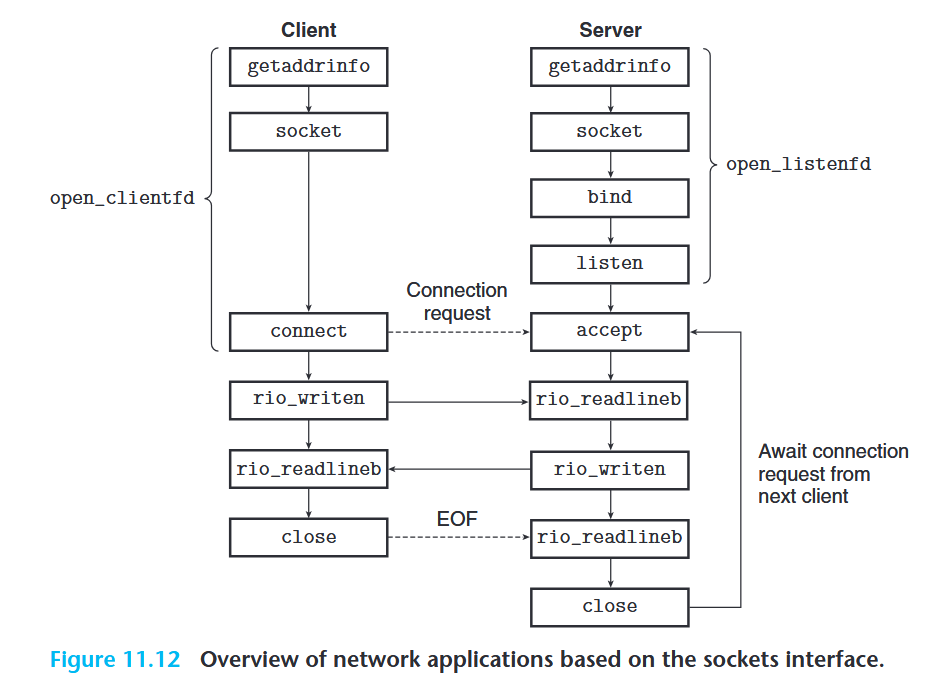

# Notes

## Socket

An overview of socket interface: 

- From the perspective of the **Linux Kernel**, a socket is *an end point for communication*.
- From the perspective of a **Linux Program**, a socket is *an open file with a corresponding file descriptor*.

